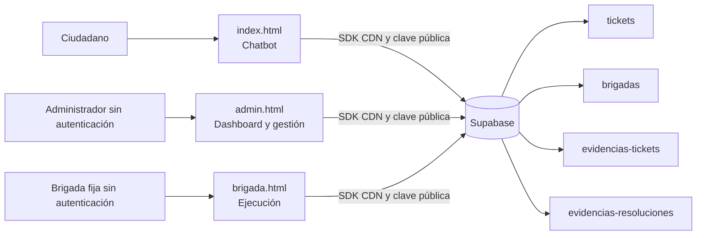

# Arquitectura actual — V1

Fecha de auditoría: 2026-07-14. Alcance: contenido presente en el repositorio; no se inspeccionó ni modificó Supabase remoto.

## Resumen

La V1 es un frontend estático sin proceso de compilación, servidor propio, configuración por entorno, autenticación, pruebas ni infraestructura declarada. Las tres páginas cargan Supabase JS desde CDN y se conectan directamente a un único proyecto Supabase con una clave pública embebida. Todo el aislamiento se expresa como filtros de cliente con `municipio_id = 1`.

## Componentes y responsabilidades

| Archivo | Responsabilidad actual | Dependencias |
| --- | --- | --- |
| `index.html` | Chat conversacional, contenido informativo fijo, alta de ticket, consulta por número, geolocalización opcional y carga de foto. | SDK Supabase CDN, tabla `tickets`, bucket `evidencias-tickets`, imágenes locales. |
| `admin.html` | Lista de tickets, métricas locales, búsqueda/filtros, asignación de brigada, verificación y devolución de trabajos. | SDK Supabase CDN, tablas `tickets` y `brigadas`, buckets de evidencias. |
| `brigada.html` | Muestra una brigada fija, sus tickets, inicio de trabajo, carga de evidencia y envío a verificación. | SDK Supabase CDN, tablas `tickets` y `brigadas`, buckets de evidencias. |
| `images/*` | Logo y material visual local para el portal. | Referenciado por el portal y/o encabezados. |

## Flujos de datos actuales

1. El ciudadano completa un flujo guiado en memoria del navegador. `index.html` genera un número con prefijo municipal y un aleatorio de cuatro dígitos, sube opcionalmente una imagen y ejecuta `insert` directo en `tickets` con estado `recibido`.
2. Cualquier visitante de `admin.html` consulta todos los tickets y brigadas filtrados en el cliente por el municipio fijo, calcula indicadores en memoria y puede asignar, aprobar o devolver tickets mediante `update` directo.
3. Cualquier visitante de `brigada.html` queda implícitamente asociado a la brigada de prueba `2`; consulta sus tickets y cambia estados/carga evidencia mediante `update` y Storage directos.
4. Las rutas de Storage se guardan en campos de ticket; el navegador descarga archivos y abre URLs tipo blob para visualizarlos.

## Modelo de datos inferido

No hay migraciones ni definición de esquema en el repositorio. El código presupone al menos:

- `tickets`: `id`, `numero`, `municipio_id`, `categoria`, `sector`, `ubicacion`, `latitud`, `longitud`, `descripcion`, `foto_url`, `estado`, `brigada_id`, `creado_en`, `foto_resolucion_url`, `comentario_resolucion`, `completado_en`, `motivo_devolucion`.
- `brigadas`: `id`, `municipio_id`, `nombre`, `descripcion`, `activa`.
- Buckets: `evidencias-tickets` y `evidencias-resoluciones`.

Las claves, restricciones, índices, políticas RLS, propietarios de buckets, retención y automatizaciones no son verificables desde este repositorio.

## Estados y transiciones implementadas

`recibido` → `asignado` → `en-proceso` → `pendiente-verificacion` → `resuelto`.

El administrador puede devolver `pendiente-verificacion` a `en-proceso`. Las condiciones de estado se comprueban en filtros de actualización del cliente, no se observa una máquina de estados ni auditoría aplicada del lado de base de datos.

## Acoplamientos relevantes

- La URL del proyecto y clave pública de Supabase se repiten en las tres páginas.
- El mismo valor de `municipio_id` fijo se repite en todos los flujos.
- Nombres de estados, buckets y representación del ticket están repartidos entre las tres páginas.
- El panel administrativo y el de brigada dependen directamente de los mismos campos de `tickets`.
- `index.html` contiene contenido institucional, catálogo de sectores, categorías y datos de contacto específicos de Laguna Salada.

## Ausencias de arquitectura

No se encontraron módulos compartidos, API/BFF, autenticación, autorización de aplicación, gestión de configuración, variables de entorno, migraciones, políticas de Supabase, CI/CD, observabilidad, pruebas automatizadas, registros de auditoría ni separación declarada de ambientes.
