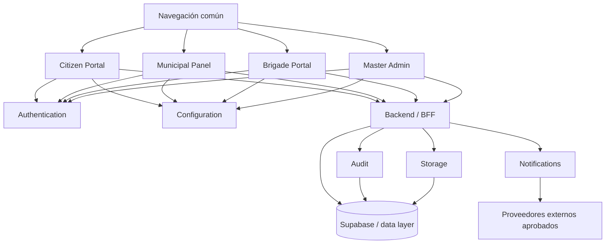

# Arquitectura V2 — Chatbot Municipal SaaS multiinstitución

Fecha: 2026-07-14. Rama de trabajo: `cm-001-chatbot-municipal-v2-foundation`.

## Resumen ejecutivo

La V2 convierte la demo V1/V1.1 en una base SaaS multiinstitución con separación explícita entre `frontend`, `backend`, `shared`, `docs` y `tests`. La arquitectura propuesta elimina dependencias directas entre páginas, concentra contratos compartidos, prepara carga dinámica de módulos y reserva el backend para secretos, reglas de negocio, auditoría, storage privado e integraciones.

## Comparación con MTIT-OS / SAIBOT

| Principio MTIT-OS observado | Estado V1/V1.1 | Decisión V2 foundation |
| --- | --- | --- |
| No modificar `main` directamente | Repositorio estaba en rama `work`; se creó una rama de misión. | Todo el trabajo queda en `cm-001-chatbot-municipal-v2-foundation`. |
| Separar desarrollo, pruebas y producción | V1 contiene cliente estático; V1.1 documenta límites y configuración local. | Se separan superficies y se documenta que no hay despliegue ni cambios de producción. |
| Mínimo privilegio y secretos fuera del cliente | V1 tiene conexión directa de navegador; V1.1 mejora el patrón pero aún requiere validación externa. | Backend/BFF será el dueño de secretos, transiciones, storage privado e integraciones. |
| Auditoría trazable | V1 carece de auditoría fuerte; V1.1 incluye migraciones de auditoría. | `audit` queda como módulo transversal obligatorio. |
| Cambios revisables y documentados | Hay documentación V1/V1.1. | Se agregan docs V2, estructura modular y contratos base. |

## Estructura propuesta

```text
/frontend
  /modules
    /citizen-portal
    /municipal-panel
    /brigade-portal
    /master-admin
    /configuration
    /authentication
    /notifications
    /audit
    /storage
  /shared
/backend
  /modules
    /configuration
    /authentication
    /notifications
    /audit
    /storage
/shared
  /contracts
  /constants
/docs
/tests
```

## Diagrama de módulos



## Responsabilidades de módulos

| Módulo | Responsabilidad V2 |
| --- | --- |
| Citizen Portal | Alta y seguimiento de solicitudes ciudadanas, contenido institucional por institución y experiencia pública. |
| Municipal Panel | Gestión municipal de tickets, asignación, supervisión, métricas operativas y revisión. |
| Brigade Portal | Operación de brigadas, evidencias, estados permitidos y trabajo de campo. |
| Master Admin | Administración SaaS de instituciones, planes, feature flags, soporte y gobierno global. |
| Configuration | Catálogos, branding, sectores, horarios, reglas por institución y parametrización sin hardcode. |
| Authentication | Identidad, sesiones, roles, MFA futuro, autorización por institución y claims. |
| Notifications | Plantillas, colas, email/SMS/WhatsApp futuro y eventos transaccionales. |
| Audit | Bitácora inmutable de acciones administrativas, operativas y de seguridad. |
| Storage | Evidencias privadas, validación de archivos, antivirus futuro, URLs firmadas y retención. |

## Navegación común y carga dinámica

- `frontend/shared/navigation.js` define una navegación común por roles para evitar menús duplicados por página.
- `frontend/shared/module-loader.js` registra manifiestos y carga entradas dinámicas con `import()`.
- Cada módulo de `frontend/modules/*` incluye `manifest.json` e `index.js` fundacional.
- Las páginas V1/V1.1 no se acoplan a esta capa; la migración debe conectar una shell V2 cuando se apruebe la implementación funcional.

## Deuda técnica restante

1. Definir shell web V2 real, router, empaquetador, estándares de lint/test y pipeline CI.
2. Implementar BFF o funciones server-side para no ejecutar transiciones privilegiadas desde navegador.
3. Validar o rediseñar RLS, claims y aislamiento multiinstitución en Supabase dev antes de producción.
4. Sustituir catálogos y textos hardcodeados por configuración institucional versionada.
5. Implementar auditoría inmutable y correlación de eventos en todos los cambios de estado.
6. Implementar storage privado con validación de tipo/tamaño, rutas por institución y URLs firmadas.
7. Agregar pruebas E2E por rol, pruebas contractuales de módulos y pruebas negativas de autorización.
8. Definir observabilidad, alertas, retención, backups y respuesta a incidentes.

## Riesgos

| Riesgo | Impacto | Mitigación |
| --- | --- | --- |
| Filtración entre instituciones | Alto | RLS por institución, claims verificados, pruebas negativas y auditoría. |
| Secretos en cliente | Alto | Backend/BFF como única capa con secretos; revisión estática. |
| Migración incompleta desde V1 | Medio | Ejecutar plan por fases con convivencia y rollback. |
| Integraciones externas prematuras | Medio | Contratos y colas antes de conectar proveedores reales. |
| Storage público o sin validación | Alto | Buckets privados, validación server-side, retención y URLs firmadas. |
